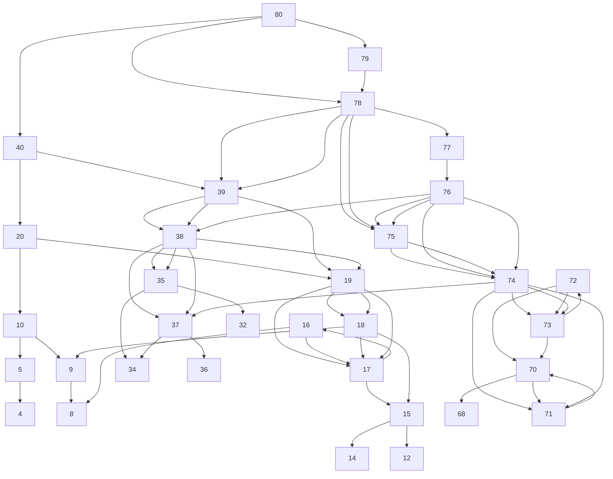

## *Решение задач ЕГЭ*
##### Автор: *Гриценко Глеб Михайлович*
##### Группа: *11-И-3*

**Задача 1.**
Условие
Исполнитель Остаточек преобразует числа и имеет следующие команды:  
Прибавить 1  
Умножить на 2  
Прибавить остаток от деления на 4   
Первая команда увеличивает число на единицу, вторая — увеличивает вдвое, третья команда добавляет к числу значение остатка от деления этого числа на 4. Определите, сколько существует чисел, из которых Остаточек может получить число 80 с помощью программы длиной не более 5 команд.  
  
Решение  
  
С любым $n \in [1, 80]$ мы можем делать операции  
$n + 1$,  
$n \cdot 2$,  
$n + n \mod 4$   
$mod$ - это оператор нахождения остатка от деления.

Давайте разберём задачу под другим ракурсом.  
У нас есть $k$ шагов. $k \in \{ 0, 1, 2, 3, 4, 5 \}$  
На каждом шаге мы можем делать одну операцию.  
То есть:
Если $k = 0$:  
Тогда под условие задачи подходит только искомое число.  
$80$  
Если $k = 1$:  
Тогда подходят числа $40, 78, 79$  
Поскольку  

$$\begin{cases}
40 \cdot 2 = 80 \\
78 + 78\mod4 = 80 \\
79 + 1 = 80
\end{cases}$$

Теперь мы можем переформулировать задачу, найдя закономерность.  
На $k + 1$ количестве шагов нам нужно получить одно из чисел, полученных на $k$-том шаге.  
Например, на шаге $1$ нам нужно получить число 80 каким-либо образом.  
С учётом имеющихся операций, мы можем сказать что нам подходят только вышеуказанные числа.  
  
Если $k = 2$  
Число $40$ мы можем выразить через $20, 38, 39$  
Число $78$ мы можем выразить через $39, 75, 77$  
Число $79$ мы можем выразить через $78$  
Легко заметить, что в наших найденных числах есть пересечения.  

Таким образом, наш список будет $20, 39, 75, 77, 78$  
Если $k = 3$ 

$$
	\begin{cases}
	20 \Rightarrow \{ 10, 18, 19 \} \\
	39 \Rightarrow \{ 38 \} \\
	75 \Rightarrow \{ 74 \} \\
	77 \Rightarrow \{ 76 \} \\
	78 \Rightarrow \{ 39,  75 \}
	\end{cases} 
$$

Исходя из данных выводов, уберём пересечения  
$\{ 10, 18, 19, 38, 39, 74, 75, 76 \}$  

Если $k = 4$

$$
	\begin{cases}
	10 \Rightarrow \{ 5, 9 \} \\
	18 \Rightarrow \{ 9, 17, 15 \} \\
	19 \Rightarrow \{ 18 \} \\
	38 \Rightarrow \{ 19, 37, 35 \} \\
	39 \Rightarrow \{ 38 \} \\	
	74 \Rightarrow \{ 73, 71, 37 \} \\
	75 \Rightarrow \{ 74 \} \\
	76 \Rightarrow \{ 18, 74, 75 \}
	\end{cases}
$$

Получается, после ряда исключений у нас останутся  
$\{ 5, 9, 15, 17, 18, 19, 35, 37, 38, 39, 71, 73, 74, 75, 76 \}$

Если $k = 5$

$$
	\begin{cases}
	5 \Rightarrow \{ 4 \} \\
	9 \Rightarrow \{ 8 \} \\
	15 \Rightarrow \{ 14 \} \\
	17 \Rightarrow \{ 16 \} \\
	18 \Rightarrow \{ 9, 17, 15 \} \\
	19 \Rightarrow \{ 18 \} \\
	35 \Rightarrow \{ 34 \} \\
	37 \Rightarrow \{ 36 \} \\
	38 \Rightarrow \{ 37, 35 \} \\
	39 \Rightarrow \{ 38 \} \\	
	71 \Rightarrow \{ 70 \} \\
	73 \Rightarrow \{ 72 \} \\
	74 \Rightarrow \{ 73, 71 \} \\
	75 \Rightarrow \{ 74 \} \\
	76 \Rightarrow \{ 38, 35, 74 \} \\
	\end{cases}
$$

Из этих уровней мы можем найти все числа, с учётом вычитания исключений:  

$$
\{ 4, 5, 6, 7, 8, 9, 10, 14, 15, 16, 17, 18, 19, 20,
31, 33, 34, 35, 36, 37, 38, 39, 40, 
70, 71, 72, 73, 74, 75, 76, 77, 78, 79, 80 \}
$$

Посчитав данные количество, можем дать ответ на задачу.

*Ответ: 34*

Для более наглядной демонстрации изобразим как граф


Наиболее наглядной демонстрации, увы не получилось.
Сделаем задачу на языку Python.

```python
MAX_STEPS = 5
# Максимальное количество шагов

TARGET = 80
# Целевое число, которое нужно получить


def predecessors(n):
    """
    Функция возвращает все числа, из которых можно получить число n за один шаг.
    Это обратные переходы для каждой команды:
    """
    prev = set()  # предыдущие числа
    

    if n - 1 >= 0:
        prev.add(n - 1)
    

    if n % 2 == 0:
        prev.add(n // 2)
    

    for r in range(4):  # остаток от деления от 0 до 3 (включ)
        p = n - r
        if p >= 0 and p % 4 == r: 
            prev.add(p)
    
    return prev


all_numbers = set([TARGET])  # начинаем с самого числа 80

current_level = set([TARGET])

for step in range(1, MAX_STEPS + 1):
    next_level = set()
    for number in current_level:
        preds = predecessors(number)
        next_level.update(preds)
    all_numbers.update(next_level)
    current_level = next_level

result = sorted(all_numbers)

print(f"Количество чисел: {len(result)}")
```

**Задача 2**  
Условие.  
Квадрат разлинован на N×N клеток (1 < N < 20). Исполнитель Буквоед может перемещаться по клеткам, выполняя за одно перемещение одну из двух команд: вправо или вниз. По команде вправо Буквоед перемещается в соседнюю правую клетку, по команде вниз – в соседнюю нижнюю. При попытке пересечь границы квадрата, обозначенные жирными линиями, Буквоед разрушается. В каждой клетке квадрата записано число от 10 до 99 или латинская буква P. Посетив клетку, Буквоед платит за её посещение, плата равна значению числа в клетке; это также относится к начальной и конечной точке маршрута. За посещение клетки P плата не взимается. Определите минимальную и максимальную плату, которую заплатит Буквоед, пройдя из левой верхней клетки в правую нижнюю, при этом маршрут должен проходить через две клетки P. В ответе укажите два числа – сначала минимальную, затем максимальную плату. Исходные данные для Буквоеда записаны в файле в виде прямоугольной таблицы, каждая ячейка которой соответствует клетке квадрата.  
Поскольку решение руками возможно, с временными затратами в 3-4 часа, предлагаю обратиться к решению на Python
```python
N = 20
grid = [
    [93, 76, 12, 31, 48, 60, 90, 37, 20, 24, 82, 31, 49, 38, 30, 96, 96, 26, 55, 59],
    [46, 82, 71, 65, 76, 35, 70, 86, 86, 55, 81, 34, 52, 12, 55, 53, 33, 51, 48, 51],
    [34, 41, 17, 87, 66, 89, 44, 92, 20, 59, 65, 62, 66, 66, 60, 84, 72, 60, 28, 70],
    [55, 48, 72, 11, 11, 98, 62, 31, 31, 31, 69,  0, 79, 19, 88, 90, 56, 85, 36, 73],
    [94, 75, 87, 14, 56, 63, 79, 94, 87, 90, 35, 75, 69, 86, 86, 86, 24, 16, 35, 64],
    [48, 56, 60, 45, 99, 40, 33, 37, 55, 83, 72, 19, 36, 41, 28, 47, 92, 56, 29, 44],
    [74, 52, 48, 28, 20, 83, 31, 41, 68, 18, 41, 41, 44, 20, 50, 32, 59, 20, 19, 44],
    [34, 69, 18, 21, 21, 37, 37, 62, 30, 99, 68, 69, 13, 94, 69, 10, 38, 42, 35, 34],
    [92, 49, 72, 52, 76, 16, 94, 18, 84, 14, 47, 41, 39, 72, 34, 36, 15, 71, 31, 29],
    [40, 93, 26, 36, 37, 16, 63, 21, 62, 38, 59, 26, 60, 82, 40, 47, 46, 39, 27, 70],
    [65, 30, 45, 68, 47, 25, 10, 22, 74, 93, 52, 58, 93, 94, 65, 16, 83, 79, 28, 42],
    [50, 93,  0, 25, 43, 24, 80, 51, 56, 46, 63, 81, 58, 68, 53, 86, 83, 74, 77, 47],
    [76, 25, 64, 11, 46, 91, 18, 36, 81, 46, 63, 99, 20, 51, 39, 44, 52, 30, 12, 83],
    [69, 87, 27, 59, 26, 45, 26, 54, 16, 73, 77, 80, 67, 60, 20,  0, 44, 56, 99, 25],
    [68, 43, 39, 83, 12, 91, 13, 56, 71, 77, 10, 28, 42, 69, 37, 28, 60, 74, 89, 18],
    [77, 17, 23, 85, 13, 59, 54, 74, 30, 34, 24, 43, 55, 36, 95, 55, 58, 90, 94, 34],
    [82, 85, 27, 73, 45, 12, 11, 47, 35, 99, 65, 95, 71, 89, 48, 66, 24, 57, 24, 47],
    [72, 18, 87, 19, 84, 24, 16, 91, 23, 53, 93, 64, 51, 57, 48, 90, 57, 81, 75, 59],
    [60, 18, 46, 39, 71, 18, 75, 10, 68, 58, 23, 77, 86, 18, 26, 54, 78, 14, 15, 75],
    [71, 36, 20, 18, 32, 54, 36, 31, 43, 96, 76, 74, 24, 49, 36, 83, 20, 55, 33, 32],
]


# Координаты всех клеток P
P_cells = [(3,11), (11,2), (13,15)]

# Функция для поиска стоимости пути между двумя точками
def path_cost(start, end):
    i1, j1 = start
    i2, j2 = end
    
    # Создаем таблицу для минимальных и максимальных стоимостей
    dp_min = [[float('inf')] * N for _ in range(N)]
    dp_max = [[-float('inf')] * N for _ in range(N)]
    
    dp_min[i1][j1] = grid[i1][j1]
    dp_max[i1][j1] = grid[i1][j1]
    
    # Заполняем таблицу от старта до финиша
    for i in range(i1, i2 + 1):
        for j in range(j1, j2 + 1):
            if i > i1:  # приходим сверху
                dp_min[i][j] = min(dp_min[i][j], dp_min[i-1][j] + grid[i][j])
                dp_max[i][j] = max(dp_max[i][j], dp_max[i-1][j] + grid[i][j])
            if j > j1:  # приходим слева
                dp_min[i][j] = min(dp_min[i][j], dp_min[i][j-1] + grid[i][j])
                dp_max[i][j] = max(dp_max[i][j], dp_max[i][j-1] + grid[i][j])
    
    return dp_min[i2][j2], dp_max[i2][j2]

# Перебираем все возможные порядки посещения двух клеток P
min_total = float('inf')
max_total = -float('inf')

for p1 in P_cells:
    for p2 in P_cells:
        if p1 != p2:
            # Считаем стоимость для маршрута: старт -> p1 -> p2 -> финиш
            cost1_min, cost1_max = path_cost((0,0), p1)
            cost2_min, cost2_max = path_cost(p1, p2)
            cost3_min, cost3_max = path_cost(p2, (N-1,N-1))
            
            # Общая стоимость (P-клетки не платные, но мы их учли как 0)
            total_min = cost1_min + cost2_min + cost3_min
            total_max = cost1_max + cost2_max + cost3_max
            
            min_total = min(min_total, total_min)
            max_total = max(max_total, total_max)

print(f"Минимальная плата: {min_total}")
print(f"Максимальная плата: {max_total}")
```
*Ответ: 1553 2545*